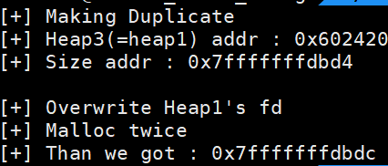

# Fastbin Duplicate

먼저 Duplicate 시키는 이유는 free된 상태에서 fd를 조작하기 어렵기 때문이다. 
바꿔말하면 fastbin 하나를 free 시키고 __free된 상태로 fd를 조작할 수 있으면__, Duplicate 시킬 이유가 없다. 

    1. fastbin 같은경우는 free할때 Top부분만 체크한다라는걸 가지고
        A-B-A 꼴로 fastbin dup을 시킬 수 있다.
    2. malloc_consolidate 알고리즘을 사용하여 fastbin하나를 free 시키고,
        largebin 하나를 요청하고, 다시 같은 fastbin을 free 시키면, 
        같은영역을 2번 할당받을 수 있다. => fd 조작 가능.
    3. 힙내 arbitrary write가 있어서 free 된 fd를 조작할 수 있으면 
        Duplicate를 시키지 않아도 된다.

다음같이 duplicate를 시키던 free된 fd를 직접 overwrite 하던 
fd만 fake size가 있는 주소로 바꿔주면 그 영역에 할당되게 된다.

## fastbin dup
일반적인 Fastbin dup은 free시 Top만 체크한다라는것을 가지고 일으킨다. 

    1. heap1, heap2를 할당한 후, heap1 -> heap2 -> heap3 순으로 Free하여, Duplicate를 시킨다.
    2. 그 후, 첫 malloc은 heap1의 주소를 받게된다. 
    3. 이때 초기화 등의 이유로 heap1의 fd자리에 값을 넣을 수 있는 경우가 대부분인데,이 때 
    Fake size가 있는 부분의 주소 - 8 (prev_size)로 fd를 조작해준다.
    4. malloc을 2번 진행해준다. (이때 받는 주소는 heap2 -> heap1 이다)
    5. 그 다음 malloc시 받게 될 주소는 fake size 가 있는 주소 + 8 이다
    ( +8, -8 은 64bit 기준이다. )

이게 가능한 이유는 Duplicate 후 첫 malloc시 받은 주소 (heap1)의 fd 를 고쳐주는건 결국 fastbin에 들어있는 heap1의 fd를 고치는것과 같게 된다.  따라서 넣은 fd가 fastbin에 등록되게 되어, malloc시 반환이 가능하게 되는것이다.

## fastbin dup consolidate
    1. fastbin size의 heap1, heap2를 할당
    2. heap1를 free
    3. largebin size의 heap3 할당 (malloc_consolidate)
    4. heap1를 free
    5. 그 후 malloc 2번은 heap1의 주소로 할당됨

heap1를 free 한후 largebin size의 heap을 할당하면 malloc_consolidate가 호출되면서 
free되었던 heap1이 unsorted bin 으로 이동하게 된다. 
따라서 fast-top에는 heap1이 없어짐으로 heap1을 한번더 free할 수 있다. 
그 후 malloc 2번은 각각 fastbin, unsorted bin 에서 주소를 꺼내오면서 Duplicate가 된다.

